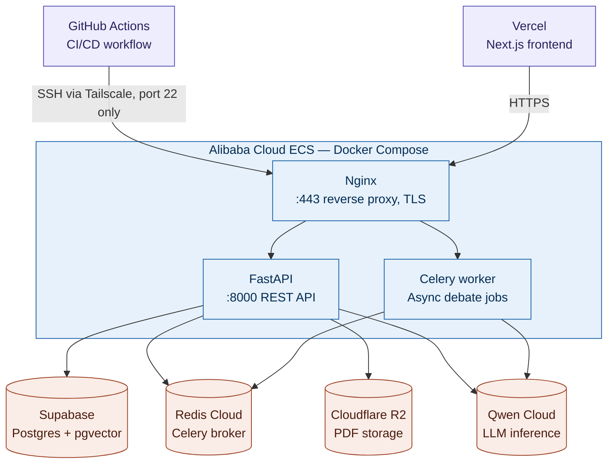
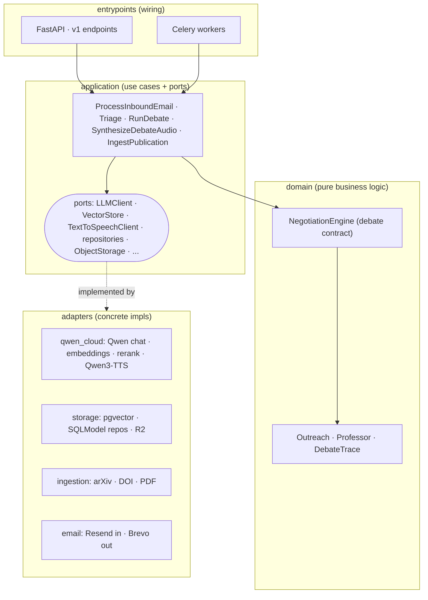
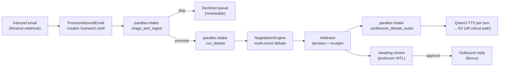

# Parallax

**An agent society that flips graduate admissions to the professor's vantage point.**

Inbound student outreach arrives as noise. Parallax runs a multi-round, simultaneous
**debate** between AI agents that evaluates each candidate against the professor's *own*
publications (RAG) and *own* declared capacity, then returns a grounded, triaged decision
with receipts — no outbound action without explicit human approval.

> In astronomy, a *parallax* is the apparent shift in an object's position when viewed from
> different vantage points. The object stays the same; the perspective changes. Multi-agent
> debate is that same idea applied to judgement — a single viewpoint introduces bias, so we
> let several argue.

Built for the Qwen Cloud Global AI Hackathon (Agent Society track).

---

## Contents

- [What it does](#what-it-does)
- [Architecture](#architecture)
- [The async pipeline](#the-async-pipeline)
- [Tech stack](#tech-stack)
- [Getting started](#getting-started)
- [Project structure](#project-structure)
- [Engineering log](#engineering-log)

---

## What it does

- A cheap **Gatekeeper** pass triages every inbound email, rejecting mass-mail slop before it
  costs a debate. Rejections land in a reviewable "Declined" queue, never a silent drop.
- Survivors go to a **moderator-driven debate**: a Research-Fit Advocate, an Authenticity
  Auditor, and a Capacity & Funding Assessor take turns over one shared transcript — each
  rebutting or conceding — while an Arbitrator judges the full transcript once at the end.
- Every claim carries a **receipt** traced back to the professor's actual indexed publications.
  The system can't hallucinate alignment, only surface or refute it.
- The professor reviews the decision by **replaying the debate** — a pixel-art seminar room
  where the agents deliberate, now with **synthesized voice per persona**.
- **No outbound email ever sends without explicit human approval.**

## Architecture

### The system


### The backend
Hexagonal (ports & adapters). Dependencies point inward; the domain never imports an adapter.



### The async pipeline

Processing is async by design: the professor reviews *after the fact* by replaying the trace.



## Tech stack

| Layer | Choice |
|---|---|
| **Models** | Qwen via DashScope — `qwen-turbo-latest` (Gatekeeper), `qwen3.6-plus` (debate), `qwen3.7-plus` (Arbitrator), `text-embedding-v4`, `qwen3-rerank`, `qwen3-tts-flash` (all on one key) |
| **Orchestration** | LangGraph `StateGraph` for the debate; Celery for async tasks |
| **Backend** | FastAPI + Celery on Alibaba Cloud ECS; Redis broker/result backend |
| **Data** | Postgres + pgvector + Auth on Supabase; PDFs/CVs in Cloudflare R2 |
| **Email** | Resend (inbound) · Brevo (outbound) |
| **Frontend** | Next.js (App Router, React 19) + Tailwind v4 on Vercel |

## Getting started

**Backend** (from `backend/`, needs Python ≥3.12 and [`uv`](https://docs.astral.sh/uv/)):

```bash
uv sync                                                             # install deps
docker compose up                                                  # API + worker + pgvector + redis
# or run pieces individually:
uv run uvicorn src.entrypoints.api.main:app --reload               # API server
uv run celery -A src.entrypoints.workers.celery_app worker --loglevel=info  # worker
uv run alembic upgrade head                                        # apply migrations
uv run pytest                                                      # tests
```

**Frontend** (from `frontend/`, needs `pnpm`):

```bash
pnpm dev      # dev server on localhost:3000
pnpm build
```

Configuration is via `backend/.env` (see `src/config.py` for the full `Settings` schema).

## Project structure

```
backend/src/
  domain/         pure business logic (models, NegotiationEngine, services) — no I/O
  application/    use cases + ports (interfaces the domain depends on)
  adapters/       concrete port impls (qwen_cloud, storage, ingestion, email, ...)
  entrypoints/    wiring — api/ (FastAPI + DI composition root), workers/ (Celery)
frontend/src/
  app/            the product surfaces: onboarding, inbox/queue, replay, decision review
  lib/            typed API client, Supabase auth, replay clock + audio
docs/parallax.md  the canonical product spec (flows, agent contract, open decisions)
```

## Engineering log

A running log of non-obvious problems and how they were solved.

<details>
<summary><strong>Qwen TTS: the model that lies with a 418</strong></summary>

Wiring the replay's voice, we first tried DashScope **CosyVoice** — it's WebSocket-only, and
the model ids our key actually served weren't the `cosyvoice-*` names. A *recognized-but-
unavailable* id (`cosyvoice-v3-flash`) failed with a generic `418 InvalidParameter` deep in
the engine that looked exactly like a request-format bug, sending us chasing a phantom SSML
issue for a while. A *truly nonexistent* id, by contrast, returns a clean `ModelNotFound`.

The real path was a different model family entirely: **Qwen3-TTS** via
`dashscope.MultiModalConversation.call` (plain HTTP, returns a short-lived WAV URL to
download). Two follow-on gotchas: the base HTTP URL must be pinned to the international host
or an intl key 401s against the domestic default, and **voice ids must be validated against
the live API** — guessing burned time twice (`Aleke`, `Catherine`, `Cang Mingzi` all 400).
Clip duration is computed from downloaded byte count ÷ header byte rate, because the returned
WAV header declares a placeholder max size.
</details>

<details>
<summary><strong>Replay audio stutter: per-turn buffering, not one reused player</strong></summary>

The first audio-replay pass used a single `<audio>` element and swapped its `.src` at every
turn boundary. Each swap discards the decoded buffer and forces a fresh load+decode — so a
turn played cleanly only if that reload happened to finish in time ("some clear, some break").

Fixed by giving **each turn its own `<audio>` element** (src set once, never swapped) and
warming a **rolling preload window** (current + next 2) ahead of the playhead, evicting clips
outside the window to bound memory. The replay clock stays the single source of truth; audio
is slaved to it, and drift-correction never seeks a still-loading clip (seeking mid-buffer is
itself a stutter source).
</details>

<details>
<summary><strong>Spoken lines reproduced failures the debate was already hardened against</strong></summary>

The TTS spoken-line layer summarizes each turn's evidentiary text into something speakable.
With only the turn's text in context, it independently invented a paper title never in the
source, guessed a gendered pronoun for the professor, and blurred the candidate's own claims
with the professor's published corpus. Fixed by passing the professor's name and forbidding
pronoun-guessing (use the name or singular "they"), banning invented specifics, and making
the candidate-claims-vs-professor-corpus distinction a hard prompt constraint — the same
grounding discipline the debate agents already carry.
</details>

<details>
<summary><strong>The Token-Plan 401 landmine</strong></summary>

Token-Plan API keys (`sk-sp-*`) silently 401 against the standard DashScope endpoint unless
routed to a separate Token-Plan host. Caught while wiring the Qwen client, before it broke a
live demo.
</details>

<details>
<summary><strong>Thinking mode defaults ON and kills debate performance (9.3x speedup when disabled)</strong></summary>

Qwen's thinking mode generates a multi-thousand-token hidden reasoning stream per call. It
collides with three features: web search 400s in non-streaming thinking mode, structured output
intermittently returns nothing on long prompts, and it defaults ON for `qwen3.5-flash` /
`qwen3.6-flash`. Debate turns were taking **95–173 seconds** each (4k–6k output tokens, blowing
past `max_tokens`), so a 15-turn debate ran **450+ seconds total**.

Fixed by explicitly disabling thinking via `enable_thinking=False` in `get_chat_model`. This
alone dropped the same debate to **89 seconds (9.3x faster)**, kept output tokens under 700,
and fixed spurious structured-output failures in the Gatekeeper + claim-verification tools too.

Now `QWEN_DEBATE_THINKING` is a granular string config: `""` (default, off everywhere) |
`"arbitrator"` (on for Arbitrator only, to A/B test if reasoning improves verdicts) | `"all"`
(on everywhere). The Arbitrator's reasoning is already sharp at 6.4s/550 tokens without thinking.
</details>

<details>
<summary><strong>Continuation hallucination and quadratic token growth (three fixes, one source)</strong></summary>

Three QA bugs traced to the same root: (1) when an agent continues a turn (re-invokes with
`[CONTINUES]` marker), it re-invoked the *same prompt* without signaling it was continuing its
own point — so it fabricated an interlocutor to rebut ("Karen's right…" before Karen had
spoken); (2) agents addressed themselves by name mid-continuation; (3) the Advocate's turns
bloated to 4,700+ tokens.

The deeper cost driver: the full debate transcript is re-sent as context on every turn, so one
verbose early turn gets re-billed as input on every later prompt — quadratic growth that pushed
~138k tokens for a single debate.

Fixed with three levers: (a) **Continuation directive** — on a continuation call, prepend
explicit "You are continuing *your own* point, first person" instruction to prevent
hallucination + self-reference; (b) **Hard `max_tokens` cap per generation** — 700 for debaters,
1500 for Arbitrator, so no single turn can run to 4,700 anymore; (c) **Receipt-excerpt
truncation in re-sent transcript** — keep full excerpts in the stored `DebateTurn` (for replay),
but truncate them in the prompt view so early turns don't re-bill their full 400-char excerpts
on every later turn (82% reduction measured on a two-receipt turn).

All three are behavior-preserving optimizations — turns still flow naturally, receipts still
appear in the replay, just lean and faster.
</details>

<details>
<summary><strong>Worker logs were invisible (pure httpx noise) until unified logging wired up</strong></summary>

Celery workers never called `configure_logging()`, so their output was raw stdlib — dominated
by httpx "200 OK" spam from `langchain_qwq` → DashScope calls, burying the actual debate
narrative. The worker appeared to hang or crash when it was actually just running slowly under
thinking-mode latency (see above).

Fixed by routing all stdlib logging (Celery, langchain, httpx, urllib3) through **one loguru
sink** with per-process wiring (Celery signals `setup_logging` and `worker_process_init`),
suppressing httpx/httpcore/urllib3 to WARNING, and adding **per-turn debate narrative logging**
with turn content preview, agent name, tools used, token/latency per LLM call, and termination
reason. Combined with per-call token tracking via callback handlers, you now see exactly what's
happening in each debate turn and why it took how long.
</details>

<details>
<summary><strong>Rerank quota burned 10x faster than necessary</strong></summary>

`qwen3-rerank` has a single scarce free-quota model with no fallback. It was being called on
every retrieval — including each debater's mid-turn tool retrieval (up to 3 per debater × 3
debaters), so one debate burned ~10 rerank calls. But the rerank call to retrieve 8 → 4 docs
was already lean; the problem was *frequency*.

Fixed with three levers: (a) **Baseline-only reranking** — the single baseline retrieval per
debate gets reranked; mid-turn tool retrievals fall back to raw vector order (already a good
filter on top of the reranked baseline); (b) **Complexity gate** — short queries (< 6 words)
skip rerank entirely and use vector similarity; (c) **In-debate cache** — a repeated query
within the same debate (the retriever is per-debate) skips both embed *and* rerank.

Net result: ~10 rerank calls → ≤1 per debate (~90% fewer), while keeping quality intact.
</details>

<details>
<summary><strong>qwen3-rerank has no OpenAI-compatible surface</strong></summary>

A `{workspace_id}.{region}.maas.aliyuncs.com/compatible-mode/v1/reranks` endpoint 404s —
rerank is DashScope's native rerank service on the main host. That wrong endpoint silently
emptied every retrieval and made the debaters narrate "404 errors" in-transcript until traced
to the reranker.
</details>
